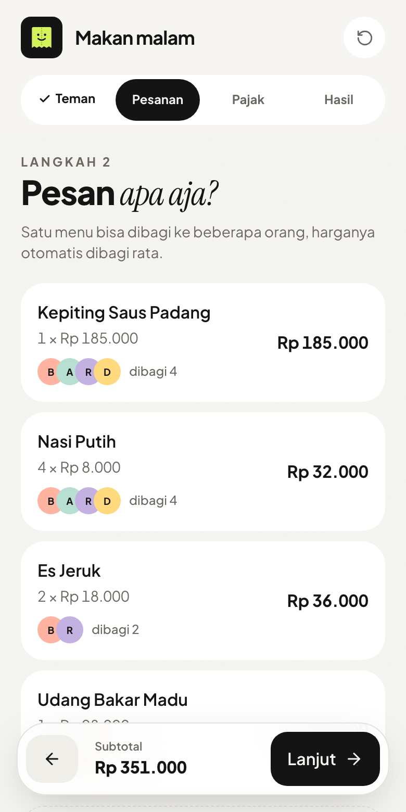
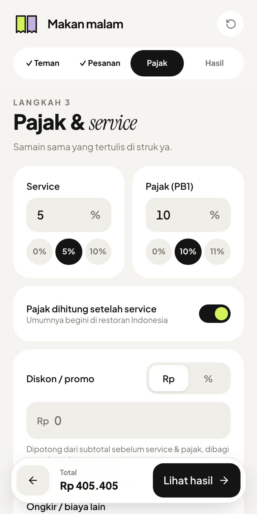
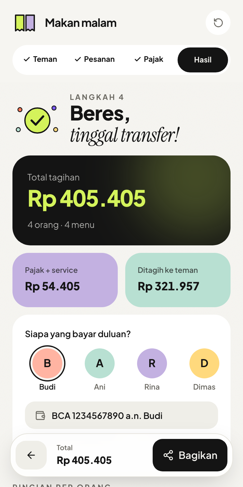
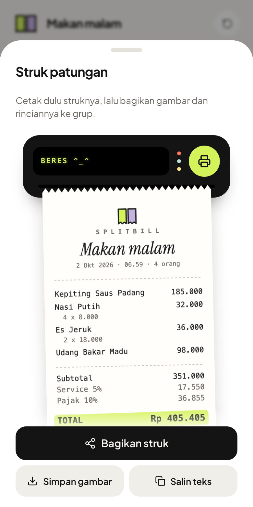

# SplitBill

Bagi tagihan makan bareng teman, lengkap dengan pajak, service, dan diskon yang dihitung adil per orang. Bisa dipasang di layar utama HP dan tetap jalan tanpa internet. Tidak perlu akun dan tidak ada server.

| Pesanan | Pajak & service | Hasil | Bagikan |
| --- | --- | --- | --- |
|  |  |  |  |

## Fitur

- **Menu bisa dibagi.** Harga menu dibagi rata di antara orang yang memesannya.
- **Service, pajak (PB1), diskon, dan biaya lain.** Diskon bisa nominal atau persen, dan pajak bisa dihitung sebelum atau sesudah service.
- **Hasil berupa struk per orang.** Terlihat siapa transfer berapa ke siapa, beserta rincian menunya.
- **Bagikan sebagai struk.** Struknya dicetak dari printer kecil, lalu gambar struk dan teks rinciannya terkirim sekaligus lewat menu share HP. Di laptop, gambarnya diunduh dan teksnya disalin. Nomor rekening atau e-wallet si pembayar ikut tertulis.
- **Urungkan.** Orang, pesanan, dan tagihan yang terhapus bisa dikembalikan.
- **Tersimpan di perangkat** (localStorage), bisa dipasang sebagai aplikasi (PWA), dan mendukung mode gelap.

## Cara hitung

```
subtotal − diskon → + service → + pajak → + biaya lain
```

- Diskon, service, dan pajak dibagi **proporsional** sesuai porsi pesanan tiap orang.
- Biaya lain (mis. ongkir) dibagi **rata**.
- Tagihan tiap orang dibulatkan ke rupiah. Selisih pembulatan ditanggung yang bayar duluan, supaya jumlahnya sama persis dengan total struk.

Logikanya ada di [`src/domain/calculate.ts`](src/domain/calculate.ts) beserta unit test-nya.

## Mulai

Butuh Node.js 22 atau lebih baru.

```bash
npm install
npm run dev
```

Untuk mencoba dari HP di jaringan yang sama, jalankan `npm run dev -- --host`.

## Perintah

| Perintah | Fungsi |
| --- | --- |
| `npm run dev` | Server development |
| `npm run build` | Build production + PWA ke `dist/` |
| `npm run typecheck` | Cek tipe TypeScript |
| `npm run lint` | Lint (oxlint), warning dianggap gagal |
| `npm test` | Unit test (Vitest) |
| `npm run test:e2e` | E2E di browser (Playwright) |
| `npm run icons` | Buat ulang ikon PWA dari `public/logo.svg` |

Pertama kali menjalankan E2E: `npx playwright install --only-shell chromium`.

## Struktur

```
src/
  domain/    logika murni: hitung tagihan, validasi langkah, isi struk, teks bagikan
  state/     reducer, penyimpanan localStorage, hook useBill
  lib/       format rupiah, id
  ui/        komponen dasar dan ilustrasi
  features/  satu folder per langkah: people, items, charges, result
  app/       App, header, navigasi langkah, bar bawah
e2e/         skenario Playwright
```

Aturan import antar layer ada di [`AGENTS.md`](AGENTS.md#6-arsitektur).

## Kontribusi

- **Aturan kerja** (branch, commit, PR, co-author, test, struktur folder): [`AGENTS.md`](AGENTS.md)
- Alurnya Issue → branch → PR → merge commit. CI menjalankan typecheck, lint, unit test, dan E2E di setiap PR.

## Deploy

Konfigurasi Vercel ada di [`vercel.json`](vercel.json). Import repo ini di Vercel, framework terdeteksi sebagai Vite (build `npm run build`, output `dist`).

## Teknologi

React 19, TypeScript 7, Vite 8, Tailwind CSS 4, Motion, Vaul, Sonner, dan vite-plugin-pwa. Test memakai Vitest dan Playwright, lint memakai oxlint.
