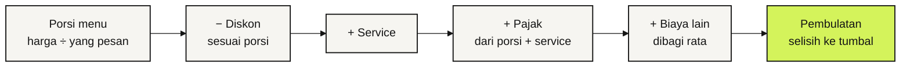
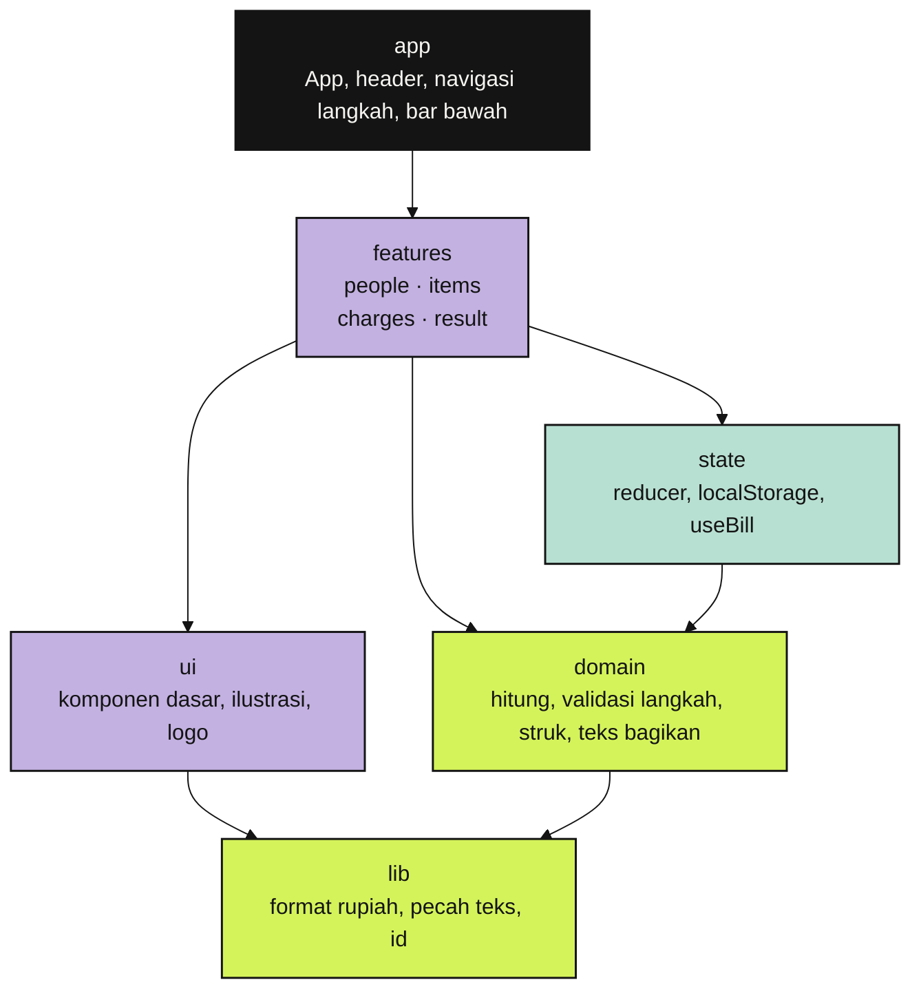

<!-- markdownlint-disable MD013 MD033 MD041 -->

<div align="center">


# Tookthel

**Jadi tumbal boleh, rugi jangan.**

Bagi tagihan nongkrong lengkap dengan pajak, service, dan diskon, lalu kirim struknya ke grup.<br />
Langsung jalan di browser HP, tanpa akun, dan tetap bisa dipakai tanpa internet.

[](https://tookthel.vercel.app)
[](https://github.com/bintangfabian/tookthel/actions/workflows/ci.yml)
[](#fitur)
[](https://react.dev)
[](https://www.typescriptlang.org)
[](https://vite.dev)
[](https://tailwindcss.com)

[**Coba sekarang**](https://tookthel.vercel.app) · [Fitur](#fitur) · [Cara hitung](#cara-hitung) · [Mulai lokal](#mulai-lokal) · [Arsitektur](#arsitektur) · [Aturan kerja](AGENTS.md)

</div>

> [!NOTE]
> **Tookthel sudah live di [tookthel.vercel.app](https://tookthel.vercel.app) sejak 2 Oktober 2026.**
> Vercel men-deploy `main` ke produksi dan membuat preview untuk setiap PR.
> Tidak ada server dan database: semua tagihan tersimpan di perangkat pengguna.

## Kenapa Tookthel

Tiap nongkrong selesai, semua mendadak sibuk sendiri pas bill datang. Ujung-ujungnya selalu ada satu orang yang jadi tumbal: bayarin dulu di kasir, lalu nagih satu per satu. Dia *took the L*.

Tookthel bikin si tumbal tetap balik modal. Masukkan siapa yang ikut dan apa yang dipesan, lalu pajak, service, dan diskonnya dibagi adil per orang. Hasilnya dicetak jadi struk dan tinggal dikirim ke grup.

<table>
  <tr>
    <td align="center"></td>
    <td align="center"></td>
    <td align="center"></td>
    <td align="center"></td>
  </tr>
  <tr>
    <td align="center"><b>Pesanan</b><br /><sub>Menu bisa dibagi beberapa orang</sub></td>
    <td align="center"><b>Pajak &amp; service</b><br /><sub>Samain dengan struk restoran</sub></td>
    <td align="center"><b>Hasil</b><br /><sub>Pilih tumbal, isi rekeningnya</sub></td>
    <td align="center"><b>Struk</b><br /><sub>Cetak, lalu bagikan ke grup</sub></td>
  </tr>
</table>

## Fitur

- **Empat langkah, satu layar HP.** Teman, Pesanan, Pajak, dan Hasil. Langkah berikutnya baru terbuka kalau yang sebelumnya sudah lengkap, dan alasannya langsung terlihat.
- **Menu bisa dibagi.** Harga menu dibagi rata di antara orang yang memesannya. Pesanan tanpa pemesan ditandai sebelum lanjut.
- **Service, pajak (PB1), diskon, dan biaya lain.** Diskon bisa nominal atau persen, dan pajak bisa dihitung sebelum atau sesudah service.
- **Pembulatan per orang** ke Rp 100, 500, atau 1.000 supaya gampang ditransfer. Selisihnya ditanggung si tumbal, jadi totalnya tetap sama dengan struk.
- **Struk yang dicetak.** Tombol Bagikan membuka printer kecil yang mencetak struk. Gambar struk dan teks rinciannya terkirim sekaligus lewat menu share HP. Di laptop, gambarnya diunduh dan teksnya disalin.
- **Rekening si tumbal ikut terkirim**, jadi teman bisa langsung transfer tanpa bertanya.
- **Bisa diurungkan.** Orang, pesanan, dan tagihan yang terhapus bisa dikembalikan dari notifikasi.
- **PWA.** Bisa dipasang di layar utama HP, tetap jalan tanpa internet setelah dibuka sekali, dan mengikuti mode gelap HP.
- **Privat.** Tanpa akun dan tanpa server. Tagihan disimpan di `localStorage` perangkat.

### Alur pakai

```mermaid
%%{init: {"theme":"base","themeVariables":{"fontFamily":"ui-sans-serif, system-ui","primaryTextColor":"#141414","lineColor":"#141414"},"flowchart":{"curve":"basis"}}}%%
flowchart LR
    T["1 · Teman<br/>siapa yang ikut"] --> P["2 · Pesanan<br/>menu dan pemesannya"]
    P --> J["3 · Pajak<br/>service, PB1, diskon, ongkir"]
    J --> H["4 · Hasil<br/>pilih tumbal, isi rekening"]
    H --> S["Cetak struk"]
    S --> G["Bagikan ke grup<br/>gambar + teks"]

    classDef langkah fill:#F6F5F1,stroke:#141414,color:#141414,stroke-width:1.5px;
    classDef struk fill:#D4F35B,stroke:#141414,color:#141414,stroke-width:1.5px;
    classDef grup fill:#C3B1E1,stroke:#141414,color:#141414,stroke-width:1.5px;
    class T,P,J,H langkah;
    class S struk;
    class G grup;
```



## Cara hitung

Urutannya mengikuti struk restoran di Indonesia, dihitung per orang:



- Diskon, service, dan pajak dibagi **proporsional** sesuai porsi pesanan tiap orang.
- Biaya lain (misalnya ongkir) dibagi **rata** ke semua orang.
- Pajak bisa dihitung dari porsi saja kalau saklar "Pajak dihitung setelah service" dimatikan.
- Tagihan selain si tumbal dibulatkan, dan si tumbal menanggung sisanya. Totalnya selalu sama persis dengan struk.

**Contoh** dari screenshot di atas: makan malam berempat, service 5%, pajak 10%, dan Budi yang bayar duluan.

| Orang | Porsi menu | Service 5% | Pajak 10% | Ditagih |
| --- | ---: | ---: | ---: | ---: |
| Ani | 86.916,67 | 4.345,83 | 9.126,25 | **Rp 100.389** |
| Rina | 104.916,67 | 5.245,83 | 11.016,25 | **Rp 121.179** |
| Dimas | 86.916,67 | 4.345,83 | 9.126,25 | **Rp 100.389** |
| Budi (tumbal) | 72.250,00 | 3.612,50 | 7.586,25 | **Rp 83.448** |
| **Total** | **351.000** | **17.550** | **36.855** | **Rp 405.405** |

Tagihan Ani, Rina, dan Dimas dibulatkan ke rupiah terdekat, sedangkan Budi menanggung sisanya supaya totalnya tetap Rp 405.405. Logikanya ada di [`src/domain/calculate.ts`](src/domain/calculate.ts), dan setiap aturan di atas punya unit test di [`calculate.test.ts`](src/domain/calculate.test.ts).

## Mulai lokal

Butuh Node.js 22 atau lebih baru.

```bash
git clone https://github.com/bintangfabian/tookthel.git
cd tookthel
npm install
npm run dev
```

Buka alamat yang muncul di terminal. Untuk mencoba dari HP di jaringan yang sama, jalankan `npm run dev -- --host`.

| Perintah | Fungsi |
| --- | --- |
| `npm run dev` | Server development |
| `npm run build` | Build production + PWA ke `dist/` |
| `npm run preview` | Menyajikan hasil build secara lokal |
| `npm run typecheck` | Cek tipe TypeScript |
| `npm run lint` | Lint (oxlint), warning dianggap gagal |
| `npm test` | Unit test (Vitest) |
| `npm run test:e2e` | E2E di browser HP (Playwright), build production dulu otomatis |
| `npm run icons` | Buat ulang favicon dan ikon PWA dari `public/logo.svg` |

Pertama kali menjalankan E2E di mesin baru: `npx playwright install --only-shell chromium`.

## Arsitektur

Aplikasi sepenuhnya di sisi klien. Komponen hanya menampilkan data dan mengirim aksi. Semua hitungan ada di `domain`, yang tidak mengenal React sehingga bisa dites dengan unit test biasa.



Panah berarti "boleh import". `app` boleh memakai semua layer, sedangkan arah sebaliknya tidak pernah terjadi. Aturan lengkapnya ada di [`AGENTS.md`](AGENTS.md#6-arsitektur).

| Layer | Isi | Contoh |
| --- | --- | --- |
| `domain` | Logika murni: hitung tagihan, syarat tiap langkah, isi struk, teks bagikan, ekspresi ilustrasi | `calculate()`, `stepBlocker()`, `buildReceipt()` |
| `state` | Reducer tagihan dan penyimpanan `localStorage` | `billReducer`, `useBill()` |
| `lib` | Utilitas umum tanpa pengetahuan soal tagihan | `rupiah()`, `wrapText()` |
| `ui` | Komponen dasar, ilustrasi berwajah, dan logo | `Button`, `Sheet`, `Printer` |
| `features` | Satu folder per langkah, menyambungkan `ui` dengan data tagihan | `ItemsStep`, `PrintSheet` |
| `app` | Komposisi halaman | `App`, `BottomBar` |

Struk yang dibagikan digambar di `<canvas>` (`src/features/result/receiptImage.ts`) dari data `buildReceipt()`. Gambar yang keluar dari printer sama persis dengan yang terkirim ke grup.

```text
tookthel/
├── src/
│   ├── domain/      # logika murni + unit test di sebelahnya
│   ├── state/       # reducer, localStorage, useBill
│   ├── lib/         # format rupiah, pecah teks, id
│   ├── ui/          # komponen dasar, ilustrasi, logo
│   ├── features/    # people, items, charges, result
│   └── app/         # App, header, navigasi, bar bawah
├── e2e/             # skenario Playwright di viewport HP
├── public/          # logo, favicon, ikon PWA
├── docs/screenshots/
├── AGENTS.md        # aturan kerja untuk manusia dan AI agent
└── vercel.json      # rewrite SPA + service worker tanpa cache
```

## Gerbang mutu

CI di GitHub Actions menjalankan semuanya di setiap PR dan setiap push ke `main`:

```bash
npm run typecheck   # tsc
npm run lint        # oxlint: React hooks, aksesibilitas, TypeScript
npm test            # Vitest: domain, state, lib
npm run test:e2e    # Playwright: alur lengkap, struk, layar 320 px
```

Perilaku baru wajib disertai test: logika di unit test, alur pengguna di E2E. Tampilan dicek di lebar 320 px dan 390 px, mode terang dan gelap.

## Deploy

Produksi ada di [Vercel](https://tookthel.vercel.app) dan terdeteksi sebagai proyek Vite (build `npm run build`, output `dist`). [`vercel.json`](vercel.json) mengarahkan semua rute ke `index.html` dan menyajikan `sw.js` tanpa cache, jadi versi baru langsung terpasang di HP pengguna.

Kalau logo berubah, ubah `public/logo.svg` dan `src/ui` bersamaan, lalu jalankan `npm run icons` untuk membuat ulang favicon dan ikon PWA.

## Berkontribusi

Alur kerja lengkapnya ada di [`AGENTS.md`](AGENTS.md). Ringkasnya:

1. Sinkron dulu (`git switch main && git pull`), lalu ambil satu item dari [roadmap #8](https://github.com/bintangfabian/tookthel/issues/8).
2. Buat branch `feat/…`, `fix/…`, atau `docs/…`, satu topik per PR.
3. Commit memakai Conventional Commits dalam Bahasa Indonesia, dengan pasangan sebagai co-author dan tanpa atribusi AI.
4. Deskripsi PR memakai bagian Apa yang berubah, Kenapa, Sudah dicek, dan Selanjutnya.
5. Setelah CI hijau, merge dengan **merge commit** (`gh pr merge --merge`).

Karakter tampilannya dijaga: kartu bento warna-warni, ilustrasi berwajah, aksen serif miring, logo struk tersenyum, dan confetti. Perubahan elemen identitas dibahas dulu dengan screenshot sebelum dan sesudah.

## Tim

<table>
  <tr>
    <td align="center"><a href="https://github.com/bintangfabian"><br /><b>Bintang Fabian Putra</b></a><br /><sub>@bintangfabian</sub></td>
    <td align="center"><a href="https://github.com/HaikalFaruq"><br /><b>Muhammad Haikal Faruq</b></a><br /><sub>@HaikalFaruq</sub></td>
  </tr>
</table>
